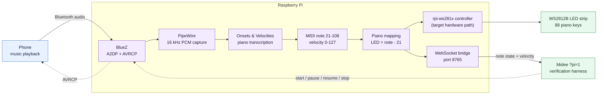

# midee

**A browser-native MIDI studio with piano-roll and guitar-fretboard
visualization.** Load a MIDI file to play it on an 88-key piano or a 6-string
guitar surface with falling notes and live highlights. Connect a MIDI
controller to play live, practice, record, loop, and export performances.

The project now also includes an experimental Raspberry Pi verification mode
for developing an 88-key piano-learning LED strip.

> Try the standard player at [midee.app](https://midee.app).

## Features

- 88-key piano visualization with multi-track playback and live note glow.
- 6-string, 24-fret guitar visualization (standard EADGBE) with ergonomic
  fingering inference, touch input, and a keyboard-accessible 6 × 25 fret grid.
- Web MIDI, sustain pedal, and computer-keyboard input.
- Sampled instruments, looping, session recording, and MIDI export.
- Synthesia-style practice modes and interactive Play-Along exercises.
- Local active-surface MP4 video rendering through WebCodecs.
- Raspberry Pi LED harness with WebSocket streaming and transport controls.
- MIDI velocity propagation from the Pi into Midee's normal input,
  visualization, and synthesizer path.

## Local development

Requirements:

- Node.js 18 or newer
- A modern browser
- Python 3.11 or newer when running the Raspberry Pi bridge

```bash
git clone https://github.com/Cosxin/midee.git
cd midee
npm install
npm run dev
```

Open <http://localhost:5173> for the normal player.

Useful commands:

```bash
npm run dev
npm run check
npm run typecheck
npm run test
npm run build
```

## Raspberry Pi LED verification harness

Open the dedicated harness at:

<http://localhost:5173/?pi=1>

`?pi=1` is the only LED-harness route. It suppresses the normal startup card
and locale popup, connects automatically, and retries when the bridge or Pi
restarts. The connection settings can be expanded to change the WebSocket URL.

The harness displays 100 logical outputs:

- Outputs `0-87` correspond to piano notes A0-C8.
- Outputs `88-99` are reserved auxiliary outputs.
- MIDI note to LED mapping is `led_index = midi_note - 21`.

The expected row comes from Midee's own active piano keys. The Pi row shows the
state received from the bridge. Differences are highlighted so timing and
mapping errors can be seen immediately.

### Data flow



The solid path is the intended phone-to-physical-LED pipeline. The WebSocket
branch drives the Midee harness with the same mapped notes, allowing the
inference and LED behavior to be inspected before the physical strip driver is
enabled. The `rpi-ws281x` output remains target hardware work; the current
repository bridge simulates its logical outputs.

The WebSocket protocol supports:

```json
{"type":"set","index":39,"on":true,"velocity":96}
```

```json
{"type":"set","index":39,"on":false,"velocity":0}
```

```json
{"type":"clear_all"}
```

Midee converts MIDI velocity from `0-127` into its internal `0-1` range. Older
bridges that omit velocity use `0.8` as a fallback.

### Reproducible MIDI-file bridge

The repository includes a minimal bridge in [`pi_bridge`](./pi_bridge). It
decodes a MIDI file on the Pi, simulates 100 LED outputs, and accepts `start`,
`pause`, `resume`, and `stop` commands from the browser.

On Raspberry Pi OS Lite:

```bash
sudo apt update
sudo apt install -y python3 python3-venv

cd ~/midee/pi_bridge
python3 -m venv .venv
.venv/bin/pip install -r requirements.txt
.venv/bin/python server.py --midi /path/to/song.mid
```

The bridge listens on all interfaces at port `8765`. It does not require GPIO
or an LED strip.

On the host computer:

```bash
npm run dev -- --host 0.0.0.0
```

Open <http://localhost:5173/?pi=1>. The default bridge address is
`ws://raspberrypi.local:8765/leds`. If the Pi uses another hostname, expand
**Pi connection**, enter its `.local` hostname or LAN address, and reconnect.

Use the harness buttons to verify:

1. The Pi decodes the MIDI file.
2. Notes 21-108 map to outputs 0-87.
3. Start, pause, resume, and stop work remotely.
4. Multiple keys remain active at the same time.
5. Velocity reaches Midee rather than being replaced by a fixed value.
6. Stop and disconnect clear all active outputs.

### Live Bluetooth audio prototype

The development Pi also runs an experimental live pipeline:

```text
phone --Bluetooth A2DP/AVRCP--> Raspberry Pi
      --PipeWire PCM--> Onsets & Velocities model
      --MIDI-like note events--> WebSocket --> Midee
```

The prototype currently uses:

- Raspberry Pi OS Lite
- BlueZ configured as an A2DP audio sink
- PipeWire and WirePlumber
- A persistent headless Bluetooth pairing agent
- The [ONSETS&VELOCITIES](https://arxiv.org/abs/2303.04485)
  piano-transcription model by Andrés Fernández, introduced in *Onsets and
  Velocities: Affordable Real-Time Piano Transcription Using Convolutional
  Neural Networks* (EUSIPCO 2023), using the authors'
  [open-source implementation](https://github.com/andres-fr/iamusica_training)
- A 1.0-second inference look-ahead
- A 750 ms minimum displayed key-down time
- AVRCP-backed start, pause, resume, and stop commands

This live Bluetooth deployment is platform-specific and is not yet represented
by a complete, reproducible installer in this repository. Do not treat the
MIDI-file bridge above as the Bluetooth installer. Before this feature is
merged, the Pi deployment will be packaged with pinned dependencies, model
download and checksum verification, generic systemd units, BlueZ/WirePlumber
configuration, and a clean-install smoke test.

Pairing the phone and selecting the Pi as its media output will remain the only
expected manual steps.

### Future: host PC as the Bluetooth sink

The next investigation will determine whether the Raspberry Pi can be bypassed
for development by using the host PC as the A2DP sink and running capture,
inference, and the WebSocket bridge locally.

The goal is to preserve the same protocol and `?pi=1` UI so the input backend
can be exchanged without changing the harness:

```text
phone --> host PC Bluetooth sink --> local inference --> Midee
```

This is future work, not a currently supported setup. Feasibility will depend
on the host operating system's ability to expose received Bluetooth audio as a
capturable stream; Linux, Windows, and macOS provide different A2DP sink
capabilities.

## MIDI Guitar visualization

Midee supports a 6-string guitar fretboard alongside the 88-key piano surface.
To use it:

1. Open a MIDI file in **Play**, or enter **Live** for controller and direct
   fretboard input.
2. Choose **Guitar** in the Piano/Guitar view selector in the top strip. The
   choice is saved locally and does not change the selected audio instrument.
3. Click or touch a fret to play its exact string/fret position. Drag
   horizontally, use a horizontal wheel gesture, or hold Shift while scrolling
   to reach later frets.
4. For keyboard access in Play or Guitar Play-Along, Tab to the interactive
   fretboard and use the controls in [Keyboard controls](#keyboard-controls).
   Live currently reserves Tab for its session shortcut.

The current guitar contract is:

- **Timbre Independence:** The active visualization surface (Piano vs Guitar) is independent of output audio timbre settings.
- **Fretboard Geometry:** Standard EADGBE 24-fret profile (MIDI 40 [E2] to MIDI 88 [E6] inclusive).
- **Supported Workflows:** MIDI file Play mode, Live input, Guitar Play-Along,
  multi-track visibility toggles, touch/mobile layouts with at least 44 px
  targets and horizontal panning, and active-surface WebCodecs MP4 export for
  loaded MIDI files in Play.
- **Accessibility:** A localized 6-row × 25-column DOM grid mirrors every
  string/fret position. It supports roving keyboard focus without intercepting
  mouse or touch input intended for the canvas.
- **Fingering Inference & Live Semantics:** Scheduled MIDI playback uses `precomputeGuitarFingerings` with 40 ms cluster windowing, movement distance penalties against immediately preceding cluster positions at the same cluster-array index, and soft MIDI channel affinity across time. Live performance uses `assignLiveGuitarVoices`, which preserves explicit direct fret positions, reserves those strings, and calls `assignGuitarCluster` with an empty state for remaining held notes (without prior-cluster history across live renders). Inferred fingering provides playable guidance and is not exact performed tablature.
- **Unsupported Voices:** Out-of-range notes (<40 or >88) or polyphony > 6 play through Midee's normal audio and synthesizer path and remain visible, but are marked unassigned and are not required for Guitar Play-Along verification.
- **Learn Exercises:** Piano-only Learn exercises temporarily force the piano
  visualization and disable the view selector with an explanation. Leaving the
  exercise restores the saved Guitar preference.
- **Explicit v1 Exclusions:** Microphone/Pi guitar audio transcription is absent (the separate Pi verification harness is piano-oriented), alternate tunings, pitch bends/MPE, and exact performed tablature.

For complete behavior and controls, see
[`docs/MIDI_GUITAR.md`](docs/MIDI_GUITAR.md). The separate
[`docs/GUITAR_TRANSCRIPTION_MODEL_EVALUATION.md`](docs/GUITAR_TRANSCRIPTION_MODEL_EVALUATION.md)
records the open-source audio-transcription research. No transcription model
was adopted in v1; shipped Guitar mode consumes note events from MIDI,
computer-keyboard, and direct fretboard input rather than raw audio.

## Main architecture

```text
core/       MIDI types, clock, music logic, and practice engines
audio/      Tone.js instruments and offline rendering
renderer/   Shared visualization routing plus the PixiJS piano roll
guitar/     Tuning, fingering, fretboard interaction, and guitar surface
midi/       Web MIDI input, looping, recording, and encoding
pi/         Pi harness UI, protocol parsing, and LED state mapping
pi_bridge/  Python MIDI-file verification bridge
ui/         controls, menus, and modals
export/     WebCodecs video export
```

## Keyboard controls

| Key | Context | Action |
| --- | --- | --- |
| `Space` | Play, outside the guitar fretboard | Play or pause |
| Hold `Space` | Live, outside the guitar fretboard | Engage software sustain until released |
| `Z-M`, `Q-P` | Computer-keyboard input | Play two octaves |
| `S D G H J`, `2 3 5 6 7` | Computer-keyboard input | Play black keys |
| Up/Down arrow | Outside the guitar fretboard | Shift computer-keyboard octave |
| Left/Right arrow | Play, outside the guitar fretboard | Skip backward or forward 10 seconds |
| `Tab` / `Shift+Tab` | Guitar in Play or Play-Along | Enter or leave the fretboard's single tab stop |
| Arrow keys | Guitar fretboard focused | Move one fret or string; later frets pan into view |
| `Home` / `End` | Guitar fretboard focused | Move to fret 0 or fret 24 on the current string |
| `Enter` / `Space` | Guitar fretboard focused | Play the focused string/fret position |

## Privacy and security

MIDI files and normal rendering stay in the browser. The Pi harness opens a
WebSocket only to the address shown in its connection field. Repository
examples use generic hostnames and contain no passwords, private keys, device
identifiers, or private network addresses.

Do not commit Pi credentials, paired-device identifiers, local home paths, or
private model-download tokens. Use environment variables or local ignored
configuration for machine-specific values.

Third-party transcription models and piano samples may have their own licenses;
review those terms before adding model or sample binaries to the repository.
